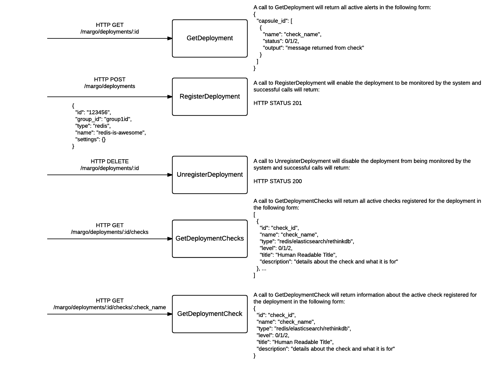
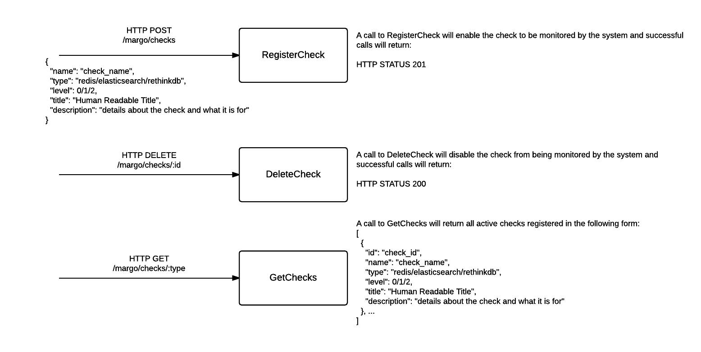

Platform Work Sample (Services)
===============================

The contained project serves as the backend/service layer of the Platform Engineering work sample.

You'll need a few things setup first before you get going.

###Environment Variables

- REDIS_URL, typically `localhost:6379`
- RETHINK_URL, typically `localhost:28015`
- COMPOSE_SERVICE_PASSWORD, whatever you want

###Services

- Redis
- RethinkDB

To seed the databases with some test data, run the following:

***WARNING***

We do flush the Redis database, so if you have other things you are working on, either start redis on a different port or backup your data

```shell
go test -tags=seed
```

To run the app,

```shell
go build ./... && ./platform-ws-services
```

If successful, you should see the following message:

```shell
listening on 8000
```

and if you've seeded the data, you should be able to run:

```shell
curl -u x:$COMPOSE_SERVICE_PASSWORD 'http://localhost:8000/margo/deployments/987654321'
```

which should return:

```shell
{
  "111111": [
    {
      "account": "compose-test",
      "capsule_id": "111111",
      "capsule_name": "redis0",
      "deployment_id": "987654321",
      "name":"redis_role",
      "output": "",
      "status":0
    }
  ]
}
```

##Data Model

###Group
The `Group` model has a 1-to-many association with a `Deployment`. It requires that an `Id` be provided during creation and by default, no `Settings` are configured. When a `Check` comes in that requires a notification, the system will first look at the `Settings` on the `Deployment` model and then fall back to the `Group` model `Settings`. If neither contains the specific integration, no notification is sent.

###Settings
The `Settings` model is part of a `Group` and `Deployment` model. It contains all the necessary information to send a notfication for a particular service (i.e. Slack, Pagerduty, HipChat, Email, etc.).

###Deployment
The `Deployment` model belongs to a `Group` and contains basic information about the customer deployment (i.e. name, account slug, etc.) and also contains `Settings` and an `[]Check`. In order for the system to send a notification for a deployment, two criteria must be met: 1. the check must be registerd with the deployment via the `[]Check` 2. `Settings` must exist for either the `Deployment` or associated `Group`.

###Check
The `Check` model is a "dictionary" of all the checks returned by each deployment type that we wish to act on.

##Sending Test Alerts

You can send an "alert" to the system with the following command:

```shell
curl -u x:jprules -XPOST http://localhost:8000/margo/alerts -d \
'{ \
  "client": "localhost", \
  "check": { \
    "name": "redis0-redis_role", \
    "capsule_name": "redis0", \
    "output": "no master found", \
    "status": 1, \
    "capsule_id": "1324354657687980", \
    "deployment_id": "987654321", \
    "account": "compose" \
  } \
}'
```

Breakdown of each attribute:
- `client`: where the alert came from
- `check`: object
- `check.name`: this is a combination of the alert name and the capsule name; in order for the system to process the alert properly, the first part of the name (i.e. everything before the first `-`) should match the `capsule_name` attribute
- `check.capsule_name`: name of the capsule, typically in the form of redisX, elasticsearchX, mongodbX, etc. where 'X' is a number, 0 is always fine for testing of course
- `check.output`: human readable text regarding the alert
- `check.status`: one of 0/1/2/3 and match with the below constants, if you want to test a notification, set the value to 1, 2, or 3; if you want to resolve a notification, set the value to 0
```Go
const (
  Resolved = iota // 0
  Warning         // 1
  Critical        // 2
  Unknown         // 3
)
```

- `check.capsule_id`: this is somewhat of a random value for testing purposes but you'll want to make the unique across deployments
- `check.deployment_id`: this needs to match up with whatever deployment(s) you have regiesterd with the system; based on the seed data, "987654321" or "13243647586970" are valid values
- `check.account`: whatever your heart desires it's just an identifer for an account in the system

##HTTP Routes

###Deployments


###Groups


###Checks


##Work Sample

- Add the necessary functionality in `listener.go` and `notififer.go` to be able to send notifications based on whether a new or resolved incident has been received (*note*: this should be determinable with the calls to Alerter)
- Implement the Pagerduty (`model_pagerduty.go`) and Slack (`model_slack.go`) notifications by making calls in `notififer.go`, a function `getInfo` has already been provided that extracts the necessary model data from a check

***HINTS:***

- Currently there's no communication channel created between listener and notifier, that's a good place to start
- The models returned in `getInfo` provides all the information meeded to determine whether a specific deployment or group should receive a notification for a particular service


